

# Nacollector

> Nacollector 可以说是一个用于采集各种 WEB 资源的工作站？！ #(滑稽)

So... [Nacollector 能做什么？](https://github.com/Zneiat/Nacollector/wiki/What-you-can-do-with-Nacollector)

在使用 Nacollector 前，请仔细阅读[《Nacollector 用户使用许可协议》](./LICENSE)

#### Features
- Material Design
- WEB 界面（使用 [CefSharp](https://github.com/cefsharp/CefSharp)）
- 实时采集日志
- 多任务管理器
- 下载内容管理器
- Cookie 获取器（可手动导入 Cookie）
- 多线程异步采集
- 使用网络代理
- 在线更新
- And More

#### Requirements
- NET >= 4.6.2

#### Using
- [CefSharp](https://github.com/cefsharp/CefSharp)
- [CsQuery](https://github.com/jamietre/CsQuery)
- Selenium.WebDriver

## Donate
如果您觉得我的项目对您有帮助，并且您愿意给予我一点小小的支持，您可以通过以下方式向我捐赠，这样可以维持项目持续地发展，非常感谢！ヽ(•̀ω•́ )ゝ

If you are enjoying this app, please consider making a donation to keep it alive.

| Alipay | Wechat | 
| :------: | :------: | 
|  |  | 

捐赠者的名字将保存于 [捐赠者列表](https://github.com/qwqcode/donate-qwqaq)，非常感谢你们的支持

## License

[《Nacollector 用户使用许可协议》](./LICENSE)

[Nacollector](https://github.com/qwqcode/Nacollector) Copyright (C) 2018 [qwqaq.com](https://qwqaq.com)

未经允许代码和衍生品不得用于商业用途，侵权必究

## Screenshots

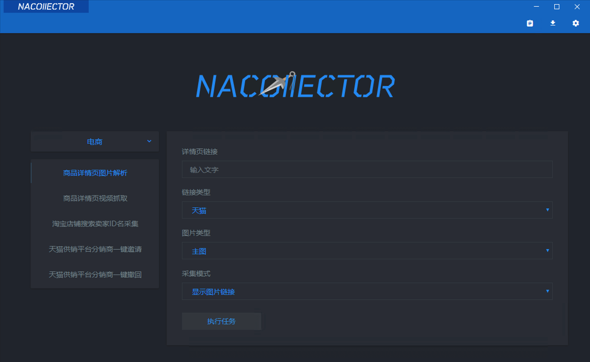
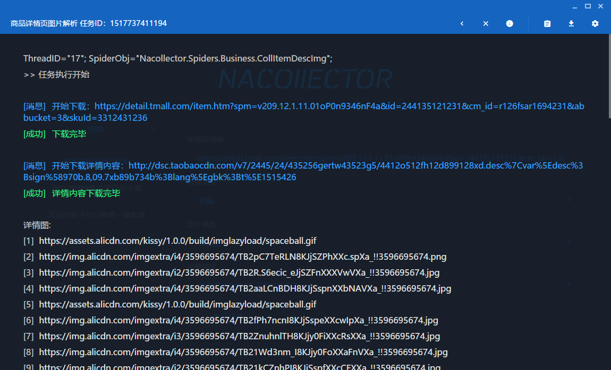
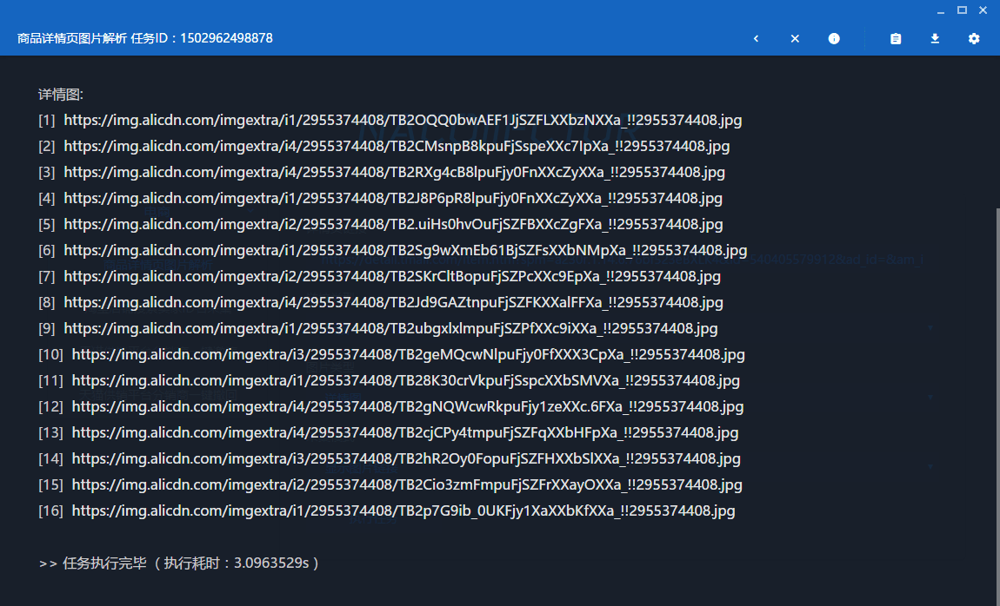
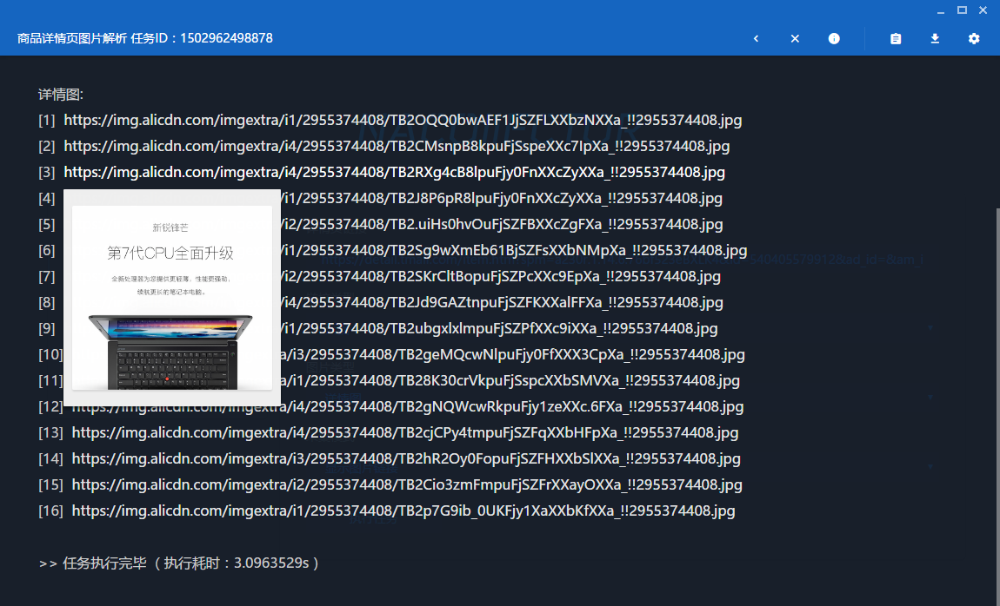
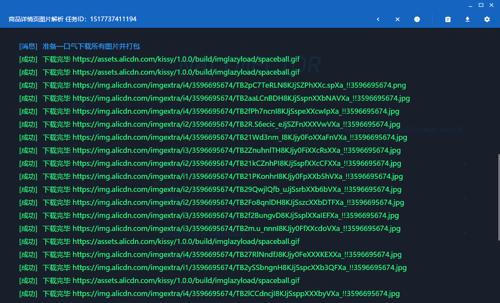
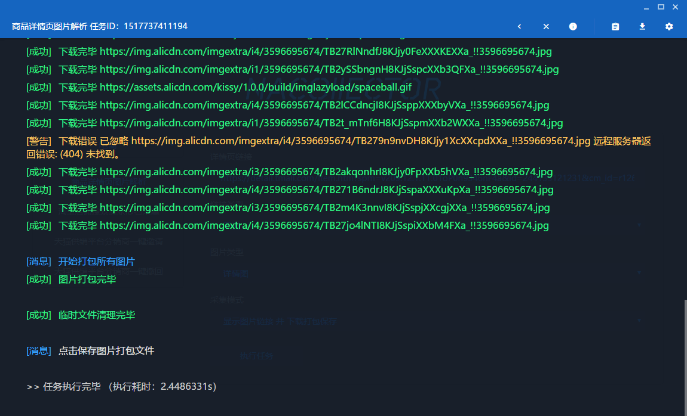
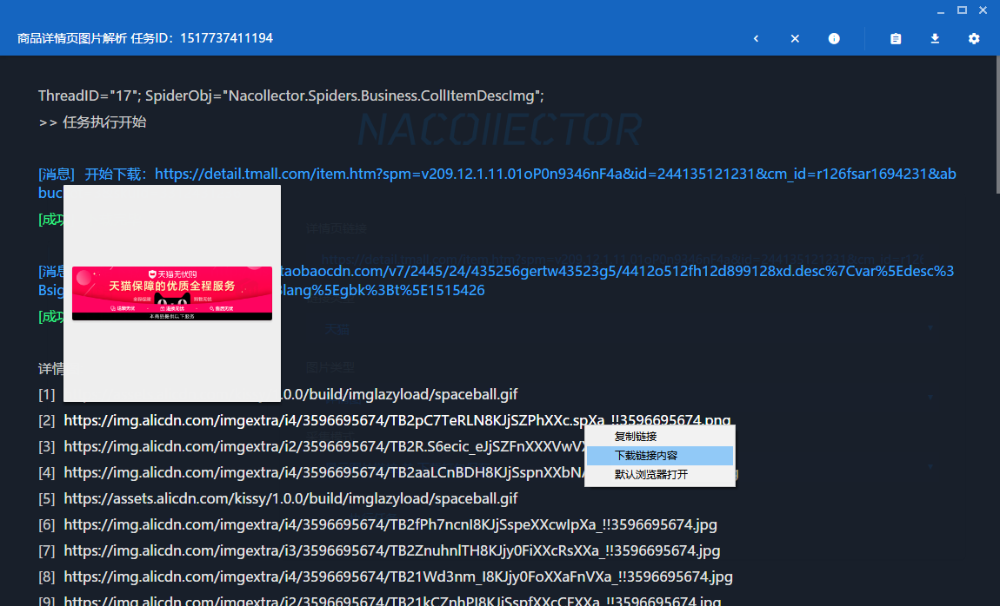
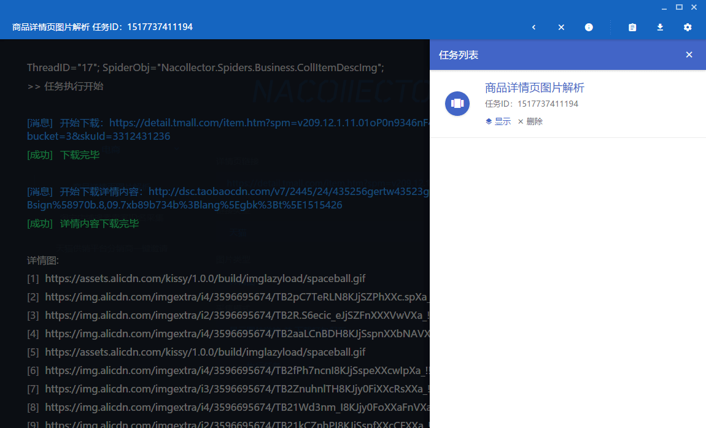
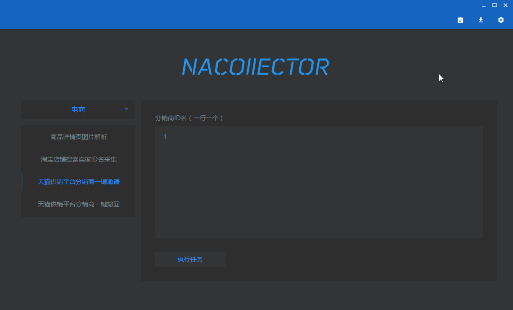

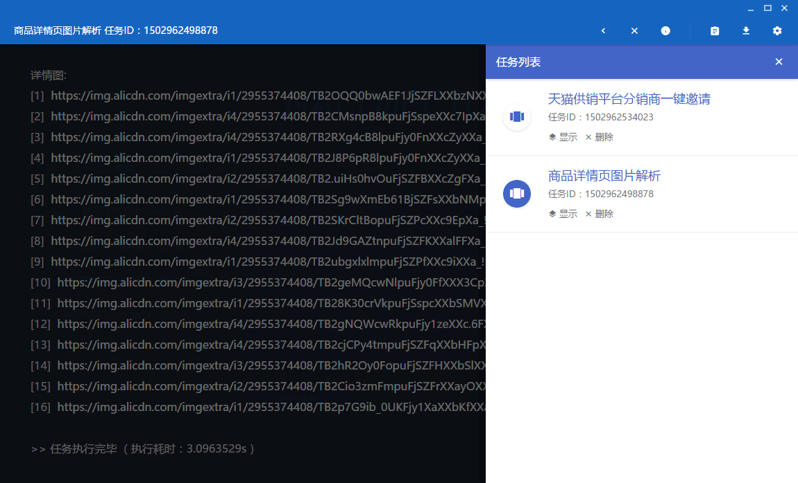

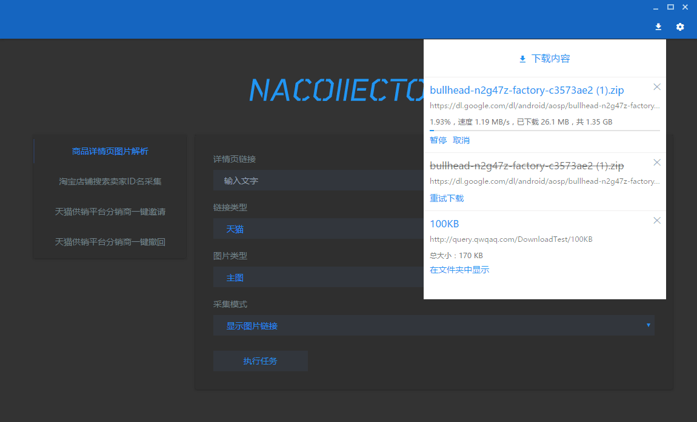
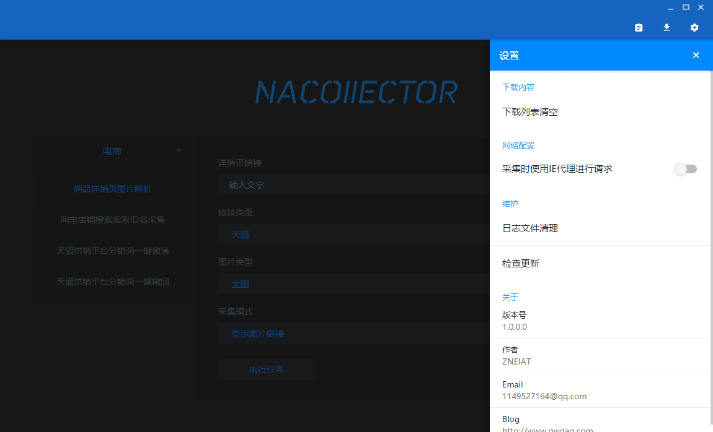

