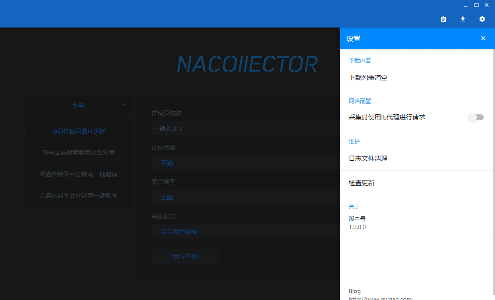

<p align="center"></p>

# Nacollector

[](https://github.com/qwqcode/Nacollector/releases/latest)  [](https://github.com/qwqcode/Nacollector/releases) [](https://github.com/qwqcode/Nacollector/commits) [](https://github.com/qwqcode/Nacollector/issues) [](https://github.com/qwqcode/Nacollector/pulls) [](https://gitter.im/Nacollector/community) [](https://github.com/qwqcode/donate-qwqaq)

**Nacollector：一款高效便捷的采集器聚合客户端**

旨在采集各类网络资源，为数据处理提供丰富支持，使繁杂的采集任务得以轻松且高效地完成。

Nacollector 提供了一套从用户界面到采集器功能的开发一体化解决方案，助你快速开发和定制专属的数据采集工作流程。

## 特性

- **友好的用户界面**：通过 Web 技术构建用户界面，基于 [CefSharp](https://github.com/cefsharp/CefSharp) 嵌入 Chromium 浏览器，实现浏览器的集成和定制，满足采集器的开发需求。
- **丰富的 C# 生态系统**：无缝接入 C# 开发者生态系统，支持 .NET 及系统 API 调用，为采集器开发提供丰富支持。
- **终端窗口及日志管理**：提供日志 API，实时跟踪和管理采集任务的运行状态与异常。
- **多任务并行处理能力**：支持多任务管理，可同时运行多个采集任务异步执行，提高工作效率。
- **下载资源管理器**：内置下载管理，便于保存和整理采集的资源。
- **完善的 Cookie 管理**：可以手动导入、自动填充、保存 Cookie，支持正则表达式匹配规则，便于处理需要登录的网站。
- **数据本地离线储存**：隐私至上，采集数据本地管理、离线保存，安全可靠。
- **多类型资源预览**：快速预览图片、视频、音频、文本等资源，便于检查采集结果。
- **任务配置界面（启动台）**：提供界面配置采集任务参数，便于启动和管理任务。
- **灵活网络连接管理**：支持设置代理，适应不同网络环境。
- **升级机制及版本管理**：支持在线和离线更新软件版本，为软件快速升级迭代提供支持。
- **可扩展设计**：采用模块化设计，可通过插件添加新功能。
- **清晰的界面布局**：使用 Material Design 设计风格，界面简单易用。
- **电商数据采集**：针对电商平台采集的商品信息优化，例如获取商品详情、价格、库存、评价等数据。

## 内置采集器

采集器代码存储于 `NacollectorSpiders` 目录下，目前支持的采集器有：

**电商采集功能**

- 商品详情页图片解析
  - 支持网站： 淘宝、天猫、苏宁、国美
  - 支持图片类型：主图、分类图、详情图
  - 支持即时预览 显示 URL
  - 支持下载单张图片 右键另存为
  - 支持下载所有图片 打包为压缩文件并保存
- 商品详情页视频抓取
- 淘宝店铺搜索卖家ID名采集
  - 支持忽略天猫店铺
- 天猫供销平台分销商一键邀请
  - 支持卖家账号登录 得到 Cookie（也可以手动输入 Cookie 字符串）
- 天猫供销平台分销商一键撤回

**资讯采集器**

- 新闻资讯采集
  - 支持网站：新浪新闻、腾讯新闻、网易新闻、搜狐新闻、百度新闻、知乎文章、推酷、简书、博客园文章

**图片采集器**

- 通用图片采集工具
  - 提供 Chrome 插件采集图片（仿花瓣、堆糖）
- 新浪微博图片采集
- Pinterest 图片采集

**小说采集器**

- 小说采集
  - 支持网站：起点中文网、晋江文学城、纵横中文网

**视频采集器**

- 优酷视频采集
- YouTube 视频采集

> 注：采集器仅供学习交流使用，请合理使用并尊重版权。

## 技术特点

本项目基于 **C# + CefSharp**，通过嵌入 Chromium 实现了浏览器的集成和定制开发。与 Electron.js 相比，Nacollector 在以下方面具有一些优势：

- **.NET 集成**：拥有丰富的 C# 开发者生态系统，与现有 C# 项目自然配合。
- **轻量快速**：Nacollector 启动速度快，内存占用低，同时无需依赖 Node.js 环境。
- **系统调用**：轻松调用操作系统 API，访问系统资源，方便开发者进行功能扩展。
- **浏览器定制**：可深度定制 Chromium 功能，灵活满足多样化的业务需求。

## 软件截图

| 主界面 | 终端界面 |
|-|-|
|  |  |

| 终端日志 1 | 终端日志 2 |
|-|-|
|  |  |

| 终端日志 3 | 终端日志 4 |
|-|-|
|  |  |

| 终端日志 5 | 终端日志 6 |
|-|-|
|  |  |

| 操作演示 | Cookie 获取器 |
|-|-|
|  |  |

| 多任务管理 | 下载管理 1 |
|-|-|
|  |  |

| 下载管理 2 | 设置界面 |
|-|-|
|  |  |

| 安装程序 1 | 安装程序 2 |
|-|-|
|  |  |

| 软件更新视频演示 | 软件更新界面 |
|-|-|
| <video width="350" src="https://github.com/user-attachments/assets/a683e83e-fcab-4d78-bb1d-5bba8d057d46" controls autoplay loop></video> |  |

| 程序安装演示视频 |
|-|
| <video width="600" src="https://github.com/user-attachments/assets/5eb3f08e-9cef-4100-9a5f-0aadf26d186e" controls autoplay loop></video> |

## Stargazers over time

[](https://starchart.cc/qwqcode/Nacollector)

## Development

### Dependencies
- NET >= 4.6.2
- [CefSharp](https://github.com/cefsharp/CefSharp)
- [CsQuery](https://github.com/jamietre/CsQuery)
- Selenium.WebDriver

### Get the sources

In order to make development easier, the frontend is included in the backend as a [git submodule](https://git-scm.com/book/en/v2/Git-Tools-Submodules).

Then, in order to tinker with the sources, start by getting both repos at once with:

``` bash
git clone --recurse-submodules https://github.com/qwqcode/Nacollector.git
```

> NOTE: since it is a submodule, when developing the frontend remember to update the backend repo accordingly.

### Quick Start

```bash
# 1. clone
git clone --recurse-submodules https://github.com/qwqcode/Nacollector.git
cd Nacollector

# 2. copy config files
cp ./Nacollector/GlobalConstant.cs.example ./Nacollector/GlobalConstant.cs

# 3. download `https://github.com/qwqcode/Nacollector/releases/download/1.3.0.0/CefSharp_v69.7z` to `./CefSharp/` and unpack

# 4. open .sln by vs
start Nacollector.sln
```

## 版权声明

仅限个人学习使用，禁止商业用途。请阅读 [《Nacollector 用户使用许可协议》](./LICENSE)。

[Nacollector](https://github.com/qwqcode/Nacollector) Copyright (C) 2018 [qwqaq.com](https://qwqaq.com)
